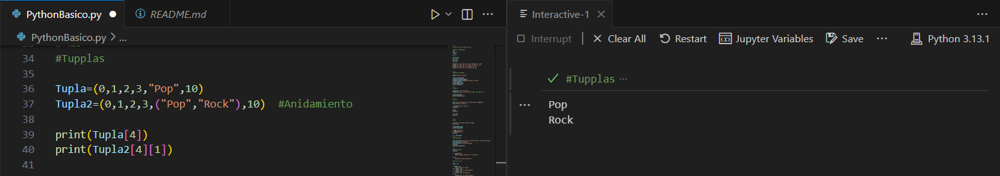
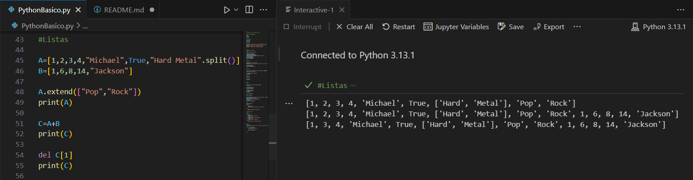
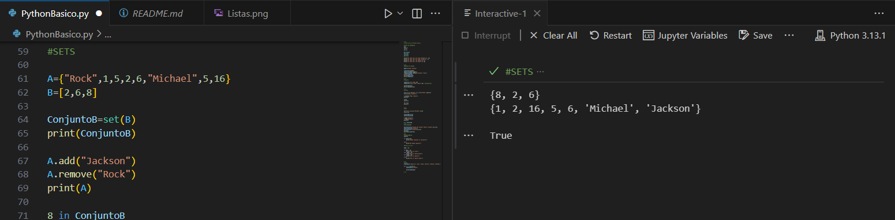

FUNDAMENTOS DE PYTHON

Este proyecto presenta una introducción a lo fundamentos de programación en Python, la identificción de los diferentes tipos de variables, la diferentes maneras de respresentarlas y el porceso de ejecución y comporbación de los fundamentos realizados.

Este coódigo contiene:

Tipos de Variables
Conversiones de Datos
Manejo de Strings
Tuplas - Listas - Sets - Diccionarios
Estructuras Condicionales
Bucles
Este repositorio tiene como objetivo servir como guía de referencia para desarrolladores que quieran iniciar programación en Python mediante la manipulación de diferentes tipos de datos y sus estructuras. A continuación se observan cada una de los resultados obtenidos en la consola de cada uno de los coódigos segmentados que se han ejecutado.

* TIPOS DE VARIABLES

  Se declaran variables de tipo String, Enteros y Flotantes para realizar conversiones obteniendo los valores que se observan en la Figura 1.

  Figura 1. Resultado obtenido (Tipos de Variables)

* STRINGS

  Se utilizan diferentes funciones que permiten obtener y modificar parámetros de la variable declarada, obteniendo los valores que se observa  en la Figura 2.

 Figura 2. Resultado obtenido (Strings)

 * TUPLAS
   Se definen las tuplas como una lista de elementos separados por comas dentro de paréntesis, cuentan con la característica de ser inmutables (no se puede modificar su contenido) además de poder realizar     anidamiento, obteniendo los valores que se observan en la Figura 3.

 Figura 3. Resultado obtenido (Tuplas)

  * LISTAS
    
    Cuentan con la misma estructura que las tuplas con paréntesis cuadrados pero estas si son mutables, obteniendo los valores que se observan en la Figura 4.

Figura 4. Resultado obtenido (Listas)

  * SETS
 
    Igual que las listas, se pueden introducir diferenres tipos de datos, no están ordenados y contienen elementos únicos, obteniendo los valores que se observan en la Figura 5.

Figura 5. Resultado Obtenido (Sets)

  * DICCIONARIOS
    
    Se caracterizan por tener claves y valores, estas claves generalmente son caracteres, se obtienen los varoles que se observan en la Figura 6.

