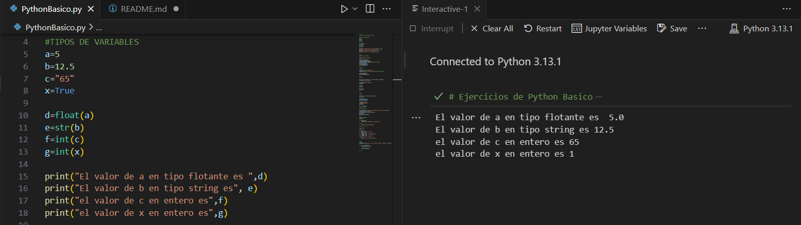

FUNDAMENTOS DE PYTHON

Este proyecto presenta una introducción a lo fundamentos de programación en Python, la identificción de los diferentes tipos de variables, la diferentes maneras de respresentarlas y el porceso de ejecución y comporbación de los fundamentos realizados.

Este coódigo contiene:

Tipos de Variables
Conversiones de Datos
Manejo de Strings
Tuplas - Listas - Sets - Diccionarios
Estructuras Condicionales
Bucles
Este repositorio tiene como objetivo servir como guía de referencia para desarrolladores que quieran iniciar programación en Python mediante la manipulación de diferentes tipos de datos y sus estructuras. A continuación se observan cada una de los resultados obtenidos en la consola de cada uno de los coódigos segmentados que se han ejecutado.

* TIPOS DE VARIABLES

  Se declaran variables de tipo String, Enteros y Flotantes para realizar conversiones obteniendo los valores que se observan en la Figura 1.

  Figura 1. Resultado obtenido

* Manejo de Strings

  Se utilizan diferentes funciones que permiten obtener parámetro de la variable declarada, obteniendo los valores que se observa  en la Figura 2.
